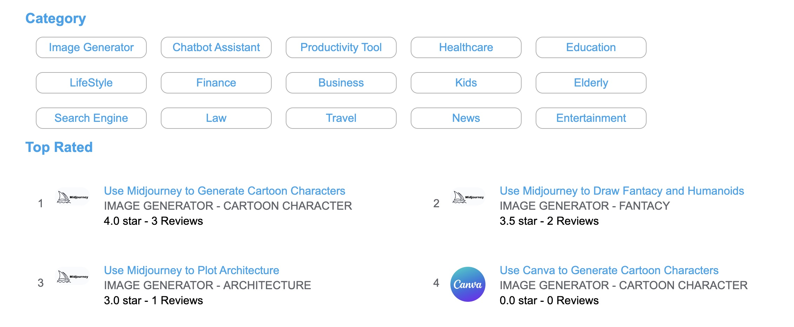
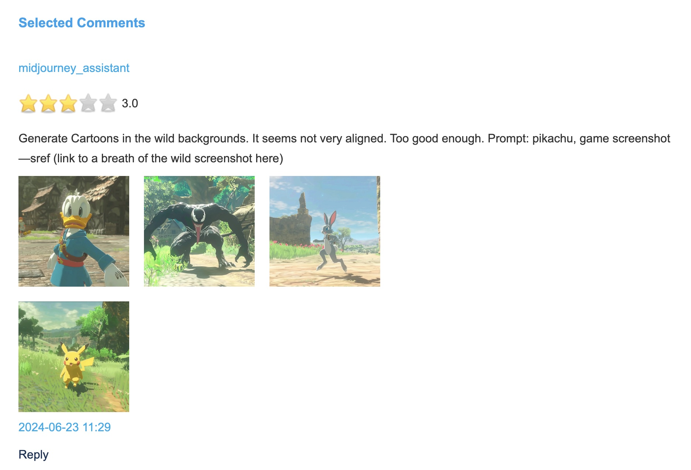

# DeepNLP AI APP Store
DeepNLP AI Store (http://www.deepnlp.org/store) is a newly released website to let users write genuine reviews, ratings, human evaluation, prompts and share use cases
about detailed aspects of AI services from users' perspective (different from researchers' perspective like the LLM/MultiModal benchmarks). 
We want to build the "Yelp" for AI and Robotics community and ease the burden of customers choosing various AI services. 




## Detailed AI Service Use Case
Users can write detailed reviews about some functions about an AI service (ChatGPT/Gemini/Perplexity/Midjourney/) like how AI is doing on "Correct Grammarly Mistakes in Essays", 
"Acting like doctors about Illness", or text-to-image ability like "Generate Cartoon Characters", "Draw Picture of Fantasy Humanoid", by uploading the screenshots
of a conversation or the generated images of AI image generator.

## Multi-Aspect Rating
Users can write review and give overall rating from 1 to 5 to each function of AI service, 
as well as give detailed rating of different aspects of each function, including "Correctness", "Helpfulness" and "Interesting", 
and customized aspects of each function, such as "Clarity of image", "Image Resolution", "Artistic", "Grammar", "Succintness" and more.




## All Categories and People Groups
We cover 30+ different categories of use cases, such as 
AI Image Generators, AI Assistant & Chatbot, AI Translator, AI Search Engine,
AI for kids, AI for adults, AI for elderly, AI in TRAVEL, AI in TRANSPORTATION
AI in HEALTHCARE, AI in BUSINESS, AI in FINANCE, AI in EDUCATION, AI in PRODUCTIVITY TOOL,
AI in POLITICS,  AI in ENTERTAINMENT, AI in NEWS, AI in ART AND SPORTS, AI in LIFESTYLE
AI in PAYMENT, AI in SOCIAL, AI in AGRICULTURE
AI in SCIENCE, AI in TECHNOLOGY, AI in TRAVEL, AI in TRANSPORTATION, AI in CAR, AI in CHARITY
AI in PUBLIC SERVICE, AI in HOUSING, AI in LAW, AI in COMMUNICATION, AI in FOOD


## Reviews and Rating of AI App Store By Categories

[AI IMAGE GENERATOR](http://www.deepnlp.org/store/image-generator) <br>
[AI Search Engine](http://www.deepnlp.org/store/search-engine)  <br>
[AI Chatbot Assistant](http://www.deepnlp.org/store/chatbot-assistant)  <br>
[AI for ELDERLY](http://www.deepnlp.org/store/elderly)  <br>
[AI for KIDS](http://www.deepnlp.org/store/kids)  <br>
[AI in LAW](http://www.deepnlp.org/store/law) <br>
[AI in FINANCE](http://www.deepnlp.org/store/finance) <br>
[AI in HEALTHCARE](http://www.deepnlp.org/store/healthcare)  <br>
[AI in BUSINESS](http://www.deepnlp.org/store/business)  <br>
[AI in EDUCATION](http://www.deepnlp.org/store/education) <br>
[AI in PRODUCTIVITY TOOL](http://www.deepnlp.org/store/productivity-tool) <br>
[AI in POLITICS](http://www.deepnlp.org/store/politics) <br>
[AI in ENTERTAINMENT](http://www.deepnlp.org/store/entertainment) <br>
[AI in NEWS](http://www.deepnlp.org/store/news) <br>
[AI in ART AND SPORTS](http://www.deepnlp.org/store/art-and-sports) <br>
[AI in LIFESTYLE](http://www.deepnlp.org/store/lifestyle) <br>
[AI in PAYMENT](http://www.deepnlp.org/store/payment) <br>
[AI in SOCIAL](http://www.deepnlp.org/store/social) <br>
[AI in AGRICULTURE](http://www.deepnlp.org/store/agriculture) <br>
[AI in SCIENCE](http://www.deepnlp.org/store/science) <br>
[AI in TECHNOLOGY](http://www.deepnlp.org/store/technology) <br>
[AI in TRAVEL](http://www.deepnlp.org/store/travel) <br>
[AI in TRANSPORTATION](http://www.deepnlp.org/store/transportation) <br>
[AI in CAR](http://www.deepnlp.org/store/car) <br>
[AI in CHARITY](http://www.deepnlp.org/store/charity) <br>
[AI in PUBLIC SERVICE](http://www.deepnlp.org/store/public-service) <br>
[AI in HOUSING](http://www.deepnlp.org/store/housing) <br>
[AI in COMMUNICATION](http://www.deepnlp.org/store/communication) <br>
[AI in FOOD](http://www.deepnlp.org/store/food) <br>


## AI Store of Image Generator

[Best AI Tools in Image Generator User Ratings Reviews and Showcase](http://www.deepnlp.org/store/image-generator) <br>


DeepNLP AI store is a platform and community for user to write genuine user reviews and ratings of AI apps and services. User can upload pictures as showcase of AI Image Generator,
such as Midjourney, Canva, Stable Diffusion, etc. People can write reviews about some common user prompts (questions or intents), such as "Generate Cartoon Characters", "Draw Fantacy and Humanoids", "Plot Architecture" and more.


### ShowCases
[Use Midjourney to Generate Cartoon Characters](http://www.deepnlp.org/store/image-generator/cartoon-character/pub-midjourney/use-midjourney-to-generate-cartoon-characters) <br>
[Use Midjourney to Draw Fantacy and Humanoids](http://www.deepnlp.org/store/image-generator/fantacy/pub-midjourney/use-midjourney-to-draw-fantacy-and-humanoids) <br>
[Use Midjourney to Plot Architecture](http://www.deepnlp.org/store/image-generator/architecture/pub-midjourney/use-midjourney-to-plot-architecture)
[Use Stable Diffusion to Generate Cartoon Characters](http://www.deepnlp.org/store/image-generator/cartoon-character/pub-stable-diffusion/use-stable-diffusion-to-generate-cartoon-characters)
[Use Stable Diffusion to Generate Fantacy and Humanoids](http://www.deepnlp.org/store/image-generator/fantacy/pub-stable-diffusion/use-stable-diffusion-to-generate-fantacy-and-humanoids)
[Use Canva to Draw Fantacy and Humanoids](http://www.deepnlp.org/store/image-generator/fantacy/pub-canva/use-canva-to-draw-fantacy-and-humanoids)


## AI Store in Law
[Best AI in Law and Legal User Ratings Reviews and Showcase](http://www.deepnlp.org/store/law) <br>


Unlike most Large Language Models(LLM) benchmark and arena's win-rate metric, which is quite difficult for customers to understand (1 vs 1 metric), users' reviews on DeepNLP AI store is about AI tool's performance in a detailed subfield of the industry, such as "Ask ChatGPT Employment Law Related Questions" and "Ask Gemini Contracts and Agreements Related Questions". Users can give rating from 1 to 5 stars on different aspects of the answeres generated by AI systems, including "Overall", "Correctness", "Helpfulness", "Interesting". They can also give rating to any customized aspect of the service, such as "whether the information is realtime", "generation speed", and many others. Here, we are going to cover different sub areas of AI in Law, includine Employment Law, Contracts and Agreements, Business and Corporate Law, Real Estate, Family Law, Personal Injury, Criminal Law, Immigration Law, and Civil Rights Law, etc.


Prompts (Questions) exmaples
- You are a lawyer specialized in employment Law. I will consult you a few questions. And my questions include "Can my employer fire me without cause and how much compensation can I get if I live in California?". 
- What are my rights regarding workplace discrimination?
- Act as an employment law expert and please answer this question "Can I fight for unjustified evaluation if I am placed on performance improvement plan?".


### Employment Law
[Best AI in Employment Law](http://www.deepnlp.org/store/law/employment-law)  <br>
[ask-chatgpt-employment-law-related-questions](http://www.deepnlp.org/store/law/employment-law/pub-chatgpt-openai/ask-chatgpt-employment-law-related-questions)  <br>
[ask perplexity ai employment law related questions](http://www.deepnlp.org/store/law/employment-law/pub-perplexity/ask-perplexity-ai-employment-law-related-questions)  <br>
[ask gemini employment law related questions](http://www.deepnlp.org/store/law/employment-law/pub-gemini-google/ask-gemini-employment-law-related-questions)  <br>
[ask claude employment law related questions](http://www.deepnlp.org/store/law/employment-law/pub-claude-anthropic/ask-claude-employment-law-related-questions)  <br>


### Contracts and Agreements
[Best AI in Contracts and Agreements](http://www.deepnlp.org/store/law/contracts-and-agreements) <br>
[Ask perplexity ai contracts and agreements related questions](http://www.deepnlp.org/store/law/contracts-and-agreements/pub-perplexity/ask-perplexity-ai-contracts-and-agreements-related-questions)  <br>
[Ask chatgpt contracts and agreements related questions](http://www.deepnlp.org/store/law/contracts-and-agreements/pub-chatgpt-openai/ask-chatgpt-contracts-and-agreements-related-questions)  <br>
[Ask gemini contracts and agreements related questions](http://www.deepnlp.org/store/law/contracts-and-agreements/pub-gemini-google/ask-gemini-contracts-and-agreements-related-questions)  <br>
[Ask claude contracts and agreements related questions](http://www.deepnlp.org/store/law/contracts-and-agreements/pub-claude-anthropic/ask-claude-contracts-and-agreements-related-questions)  <br>


###  Business and Corporate Law
[Best AI in Business and Corporate Law](http://www.deepnlp.org/store/law/business-and-corporate-law)
[ask gemini business and corporate law related questions](http://www.deepnlp.org/store/law/business-and-corporate-law/pub-gemini-google/ask-gemini-business-and-corporate-law-related-questions)  <br>
[ask chatgpt business and corporate law related questions](http://www.deepnlp.org/store/law/business-and-corporate-law/pub-chatgpt-openai/ask-chatgpt-business-and-corporate-law-related-questions)  <br>
[ask perplexity ai business and corporate law related questions](http://www.deepnlp.org/store/law/business-and-corporate-law/pub-perplexity/ask-perplexity-ai-business-and-corporate-law-related-questions)  <br>
[ask claude business and corporate law related questions](http://www.deepnlp.org/store/law/business-and-corporate-law/pub-claude-anthropic/ask-claude-business-and-corporate-law-related-questions)  <br>


### Real Estate
[Best AI in Real Estate Law](http://www.deepnlp.org/store/law/real-estate)
[ask-chatgpt-real-estate-related-questions](http://www.deepnlp.org/store/law/real-estate/pub-chatgpt-openai/ask-chatgpt-real-estate-related-questions) <br>
[ask-perplexity-ai-real-estate-related-questions](http://www.deepnlp.org/store/law/real-estate/pub-perplexity/ask-perplexity-ai-real-estate-related-questions) <br>
[ask-gemini-real-estate-related-questions](http://www.deepnlp.org/store/law/real-estate/pub-gemini-google/ask-gemini-real-estate-related-questions) <br>
[ask claude real estate related questions](http://www.deepnlp.org/store/law/real-estate/pub-claude-anthropic/ask-claude-real-estate-related-questions) <br>


### Civil Rights Law
[Best AI in Civil Rights Law](http://www.deepnlp.org/store/law/civil-rights-law) <br>
[ask perplexity ai civil rights law related questions](http://www.deepnlp.org/store/law/civil-rights-law/pub-perplexity/ask-perplexity-ai-civil-rights-law-related-questions) <br>
[ask gemini civil rights law related questions](http://www.deepnlp.org/store/law/civil-rights-law/pub-gemini-google/ask-gemini-civil-rights-law-related-questions) <br>
[ask chatgpt civil rights law related questions](http://www.deepnlp.org/store/law/civil-rights-law/pub-chatgpt-openai/ask-chatgpt-civil-rights-law-related-questions) <br>
[ask claude civil rights law related questions](http://www.deepnlp.org/store/law/civil-rights-law/pub-claude-anthropic/ask-claude-civil-rights-law-related-questions) <br>


### Family Law
[Best AI in Family Law](http://www.deepnlp.org/store/law/family-law)
[Ask chatgpt family law and related question](http://www.deepnlp.org/store/law/family-law/pub-chatgpt-openai/ask-chatgpt-family-law-and-related-question) <br>
[Ask claude family law related questions](http://www.deepnlp.org/store/law/family-law/pub-claude-anthropic/ask-claude-family-law-related-questions) <br>
[Ask perplexity ai family law related questions](http://www.deepnlp.org/store/law/family-law/pub-perplexity/ask-perplexity-ai-family-law-related-questions) <br>
[Ask gemini family law related questions](http://www.deepnlp.org/store/law/family-law/pub-gemini-google/ask-gemini-family-law-related-questions) <br>


### Personal Injury
[Best AI in Personal Injury](http://www.deepnlp.org/store/law/personal-injury) <br>
[Ask perplexity ai personal injury law and accidents related question](http://www.deepnlp.org/store/law/personal-injury/pub-perplexity/ask-perplexity-ai-personal-injury-law-and-accidents-related-question) <br>
[Ask chatgpt personal injury law and accidents related question](http://www.deepnlp.org/store/law/personal-injury/pub-chatgpt-openai/ask-chatgpt-personal-injury-law-and-accidents-related-question) <br>
[Ask claude personal injury law and accidents related question](http://www.deepnlp.org/store/law/personal-injury/pub-claude-anthropic/ask-claude-personal-injury-law-and-accidents-related-question) <br>
[Ask gemini personal injury law and accidents related question](http://www.deepnlp.org/store/law/personal-injury/pub-gemini-google/ask-gemini-personal-injury-law-and-accidents-related-question) <br>

### Criminal Law
[Best AI in Criminal Law](http://www.deepnlp.org/store/law/criminal-law)
[Ask gemini criminal law related questions](http://www.deepnlp.org/store/law/criminal-law/pub-gemini-google/ask-gemini-criminal-law-related-questions) <br>
[Ask perplexity ai criminal law related questions](http://www.deepnlp.org/store/law/criminal-law/pub-perplexity/ask-perplexity-ai-criminal-law-related-questions) <br>
[Ask chatgpt criminal law related questions](http://www.deepnlp.org/store/law/criminal-law/pub-chatgpt-openai/ask-chatgpt-criminal-law-related-questions) <br>
[Ask claude criminal law related questions](http://www.deepnlp.org/store/law/criminal-law/pub-claude-anthropic/ask-claude-criminal-law-related-questions) <br>

### Immigration Law
[Best AI in immigration law](http://www.deepnlp.org/store/law/immigration-law)
[Ask perplexity ai immigration law related questions](http://www.deepnlp.org/store/law/immigration-law/pub-perplexity/ask-perplexity-ai-immigration-law-related-questions) <br>
[Ask gemini immigration law related questions](http://www.deepnlp.org/store/law/immigration-law/pub-gemini-google/ask-gemini-immigration-law-related-questions) <br>
[Ask chatgpt immigration law related questions](http://www.deepnlp.org/store/law/immigration-law/pub-chatgpt-openai/ask-chatgpt-immigration-law-related-questions) <br>
[Ask gemini criminal law related questions](http://www.deepnlp.org/store/law/criminal-law/pub-gemini-google/ask-gemini-criminal-law-related-questions) <br>


## AI in Finance: User Ratings, Reviews and Showcase

[Best AI in Finance User Ratings Reviews and Showcase](http://www.deepnlp.org/store/finance) <br>


Prompts (Questions)
- You are an expert in stock investment, and I will consult you a few questions. The questions include "Is Tesla a buy stock? Should I sell Nvidia stock after financial report season?"
- Please act as a trader. Please answer this question "Summarize Nvidia's GAAP Financial Report Q4 FY24 statistics and compare P/E ratio with other tech company such as google and apple"
- Act as a financial analyst and "Please draw a bar chart comparing the market capital of Google, Apple, Tesla, Nvidia and Microsoft."


### AI in Investment Finance
[Best AI in Investment Finance](http://www.deepnlp.org/store/finance/investment) <br>
[Ask chatgpt facts about investment and seek advice](http://www.deepnlp.org/store/finance/investment/pub-chatgpt-openai/ask-chatgpt-facts-about-investment-and-seek-advice) <br>
[Ask Gemini Facts about Investment and Seek Advice](http://www.deepnlp.org/store/finance/investment/pub-gemini-google/ask-gemini-facts-about-investment-and-seek-advice) <br>
[Ask Claude INVESTMENT Related Questions](http://www.deepnlp.org/store/finance/investment/pub-claude-anthropic/ask-claude-investment-related-questions) <br>
[Ask Perplexity AI INVESTMENT Related Questions](http://www.deepnlp.org/store/finance/investment/pub-perplexity/ask-perplexity-ai-investment-related-questions) <br>


### AI in INSURANCE Finance
[Best AI in Finance INSURANCE User Ratings Reviews and Showcase](http://www.deepnlp.org/store/finance/insurance) <br>
[Ask Gemini INSURANCE Related Questions](http://www.deepnlp.org/store/finance/insurance/pub-gemini-google/ask-gemini-insurance-related-questions) <br>
[Ask Perplexity AI INSURANCE Related Questions](http://www.deepnlp.org/store/finance/insurance/pub-perplexity/ask-perplexity-ai-insurance-related-questions) <br>
[Ask ChatGPT INSURANCE Related Questions](http://www.deepnlp.org/store/finance/insurance/pub-chatgpt-openai/ask-chatgpt-insurance-related-questions) <br>
[Ask Claude INSURANCE Related Questions](http://www.deepnlp.org/store/finance/insurance/pub-claude-anthropic/ask-claude-insurance-related-questions) <br>

### AI in Mortgage and Loan Finance
[Best AI in Mortgage Loan Finance](http://www.deepnlp.org/store/finance/mortgage-&-loan) <br>
[Ask ChatGPT MORTGAGE & LOAN Related Questions](http://www.deepnlp.org/store/finance/mortgage-&-loan/pub-chatgpt-openai/ask-chatgpt-mortgage-&-loan-related-questions) <br>
[Ask Gemini MORTGAGE & LOAN Related Questions](http://www.deepnlp.org/store/finance/mortgage-&-loan/pub-chatgpt-openai/ask-gemini-mortgage-&-loan-related-questions) <br>
[Ask Claude MORTGAGE & LOAN Related Questions](http://www.deepnlp.org/store/finance/mortgage-&-loan/pub-claude-anthropic/ask-claude-mortgage-&-loan-related-questions) <br>
[Ask Perplexity AI MORTGAGE & LOAN Related Questions](http://www.deepnlp.org/store/finance/mortgage-&-loan/pub-perplexity/ask-perplexity-ai-mortgage-&-loan-related-questions) <br>


### AI in BANKING Finance
[Best AI in BANKING Finance](http://www.deepnlp.org/store/finance/banking) <br>
[Ask Perplexity AI BANKING Related Questions](http://www.deepnlp.org/store/finance/banking/pub-perplexity/ask-perplexity-ai-banking-related-questions) <br>
[Ask Gemini BANKING Related Questions](http://www.deepnlp.org/store/finance/banking/pub-gemini-google/ask-gemini-banking-related-questions) <br>
[Ask ChatGPT BANKING Related Questions](http://www.deepnlp.org/store/finance/banking/pub-chatgpt-openai/ask-chatgpt-banking-related-questions) <br>
[Ask Claude BANKING Related Questions](http://www.deepnlp.org/store/finance/banking/pub-claude-anthropic/ask-claude-banking-related-questions) <br>


### AI in DEBT Finance
[Best AI in Debt Finance](http://www.deepnlp.org/store/finance/debt) <br>
[Ask Claude DEBT Related Questions](http://www.deepnlp.org/store/finance/debt/pub-claude-anthropic/ask-claude-debt-related-questions) <br>
[Ask ChatGPT DEBT Related Questions](http://www.deepnlp.org/store/finance/debt/pub-chatgpt-openai/ask-chatgpt-debt-related-questions) <br>
[Ask Gemini DEBT Related Questions](http://www.deepnlp.org/store/finance/debt/pub-gemini-google/ask-gemini-debt-related-questions) <br>
[Ask Perplexity AI DEBT Related Questions](http://www.deepnlp.org/store/finance/debt/pub-perplexity/ask-perplexity-ai-debt-related-questions) <br>


## AI in Healthcare
[Best AI in Healthcare User Ratings Reviews and Showcase](http://www.deepnlp.org/store/healthcare/) <br>

### HOSPITAL APPOINTMENT
[Best AI in HOSPITAL APPOINTMENT](http://www.deepnlp.org/store/healthcare/hospital-appointment)

### HOSPITAL
[Best AI in Hospital Healthcare](http://www.deepnlp.org/store/healthcare/hospital)

### AI in ILLNESS
[Best AI in ILLNESS Healthcare](http://www.deepnlp.org/store/healthcare/illness)

### MEDICINE
[Best AI in Medicine Healthcare](http://www.deepnlp.org/store/healthcare/medicine)

### NURSING
[Best AI in NURSING Healthcare](http://www.deepnlp.org/store/healthcare/nursing)

### BEAUTY
[Best AI in BEAUTY Healthcare](http://www.deepnlp.org/store/healthcare/nursing)

### ELDERLY CARE
[Best AI in ELDERLY CARE](http://www.deepnlp.org/store/healthcare/elderly-care)

### MEDICAL INSTRUMENT
[Best AI in MEDICAL INSTRUMENT](http://www.deepnlp.org/store/healthcare/medical-instrument)


## AI for Elderly: User Ratings, Reviews and Showcase
[Best AI for Elderly User Ratings, Reviews and Showcase](http://www.deepnlp.org/store/elderly) <br>

Prompts (Questions) exmaples
What are the side effects of [medication]?
How can I manage [illness]?

e.g. 
What are the side effects of Tylenol?
How can I manage arthritis pain?


### ShowCases
[Elderly People Ask Gemini Personal Hobbies Related Questions](http://www.deepnlp.org/store/elderly/hobby/pub-gemini-google/elderly-people-ask-gemini-personal-hobbies-related-questions) <br>
[Elderly People Ask Gemini Legal Questions](http://www.deepnlp.org/store/elderly/legal/pub-gemini-google/elderly-people-ask-gemini-legal-questions) <br>
[Elderly People Ask Gemini Health and Medicine Related Questions](http://www.deepnlp.org/store/elderly/health/pub-gemini-google/elderly-people-ask-gemini-health-and-medicine-related-questions) <br>
[Elderly People Ask ChatGPT Health and Medicine Related Questions](http://www.deepnlp.org/store/elderly/health/pub-chatgpt-openai/elderly-people-ask-chatgpt-health-and-medicine-related-questions) <br>
[Elderly People Ask Perplexity AI Health and Medicine Related Questions](http://www.deepnlp.org/store/elderly/health/pub-perplexity/elderly-people-ask-perplexity-ai-health-and-medicine-related-questions) <br>
[Elderly People Ask Claude Health and Medicine Related Questions](http://www.deepnlp.org/store/elderly/health/pub-claude-anthropic/elderly-people-ask-claude-health-and-medicine-related-questions) <br>


## AI for Kids: User Ratings, Reviews and Showcase

[Best AI for Kids User Ratings, Reviews and Showcase](http://www.deepnlp.org/store/kids)

Prompts (Questions) exmaples

### STORY TELLING for KIDS
1. Please tell me a bedtime story about unicorns for my 4 years old daughter.
2. Help me write a story about Paw Patrol Dogs Fighting Bad Guys

### DRAWING|AIGC
1. Help me Draw a picture about Paw Patrol Dogs Chase Driving Police Car
2. Help me Draw a picture Peppa Pig playing in the swimming pool

ShowCases
[Ask Gemini to Tell a Bedtime Story](http://www.deepnlp.org/store/kids/story-telling/pub-gemini-google/ask-gemini-to-tell-a-bedtime-story)
[Ask Gemini to Draw Cartoon Characters](http://www.deepnlp.org/store/kids/drawing/pub-gemini-google/ask-gemini-to-draw-cartoon-characters)
[Ask Gemini to Tell a Bedtime Story](http://www.deepnlp.org/store/kids/story-telling/pub-chatgpt-openai/ask-chatgpt-to-tell-a-bedtime-story)
[Ask ChatGPT to Draw Cartoon Character](http://www.deepnlp.org/store/kids/drawing/pub-chatgpt-openai/ask-chatgpt-to-draw-cartoon-character)


## AI in LifeStyle
[Best AI in LifeStyle User Ratings, Reviews and Showcase](http://www.deepnlp.org/store/lifestyle)

Prompts (Questions) exmaples

#### Act as ${role}
I want you to respond and answer like ${role} using the tone, manner that ${role} would use. Do not write any explanations. My first sentence is ${your_question}.

#### ShowCases
[Ask ChatGPT to Act As Lovers in a Relationship](http://www.deepnlp.org/store/lifestyle/relationship/pub-chatgpt-openai/ask-chatgpt-to-act-as-lovers-in-a-relationship) <br>
[Ask Gemini to Act As Lovers in a Relationship](http://www.deepnlp.org/store/lifestyle/relationship/pub-gemini-google/ask-gemini-to-act-as-lovers-in-a-relationship) <br>
[Ask Character AI to Act As Lovers in a Relationship](http://www.deepnlp.org/store/lifestyle/relationship/pub-character-ai/ask-character-ai-to-act-as-lovers-in-a-relationship) <br>
[Ask Doubao to Act As Lovers in a Relationship](http://www.deepnlp.org/store/lifestyle/relationship/pub-doubao-douyin/ask-doubao-to-act-as-lovers-in-a-relationship) <br>
[Ask Qwen AI from Alibaba to Act As Lovers in a Relationship](http://www.deepnlp.org/store/lifestyle/relationship/pub-qwen-alibaba/ask-qwen-ai-from-alibaba-to-act-as-lovers-in-a-relationship) <br>
[Ask Zhipu AI to Act As Lovers in a Relationship](http://www.deepnlp.org/store/lifestyle/relationship/pub-zhipu-ai/ask-zhipu-ai-to-act-as-lovers-in-a-relationship) <br>

## AI in Productivity Tool
[Best AI in Productivity Tool User Ratings, Reviews and Showcase](http://www.deepnlp.org/store/productivity-tool)


### Writing Tool
[Best AI in Writing Tool](http://www.deepnlp.org/store/productivity-tool/writing)

### Research Analysis
[Best AI in Research & Analysis](http://www.deepnlp.org/store/productivity-tool/research-&-analysis)

###  Programming
[Best AI in Programming](http://www.deepnlp.org/store/productivity-tool/programming)

Prompts:
Show me the ${programming language} code of ${algorithm}, no explanation.
Write the ${programming language} to implement ${function}, no explanation.
Generate the ${programming language} code of a ${description} website, no explanation.
Find the ${statistic} from ${data_source} and display in ${format}.

e.g. 
1. Show me the latex code of KL Divergence
2. Write the python code for QuickSort Implementation
3. Generate the html code of a login page of a community website, no explanation.
4. Find the 2023 divorce rate of all states in US and display in the table and line chart.


#### ShowCase
##### Programming
[Gemini for Programming](http://www.deepnlp.org/store/productivity-tool/programming/pub-gemini-google/gemini-for-programming)
[ChatGPT for Programming](http://www.deepnlp.org/store/productivity-tool/programming/pub-chatgpt-openai/chatgpt-for-programming)

##### Plot Chat
[Use ChatGPT to Draw Plot of Math Function](http://www.deepnlp.org/store/productivity-tool/research-&-analysis/pub-chatgpt-openai/use-chatgpt-to-draw-plot-of-math-function)
##### Data Analysis
[Use Gemini to Conduct Data Analysis](http://www.deepnlp.org/store/productivity-tool/research-&-analysis/pub-gemini-google/use-gemini-to-conduct-data-analysis)


## Related
http://www.deepnlp.org/blog/ <br>
http://www.deepnlp.org/equation/ <br>
http://www.deepnlp.org/search/ <br>
http://www.deepnlp.org/workspace/ai_courses/ <br>
http://www.deepnlp.org/workspace/aigc_chart/ <br>
http://www.deepnlp.org/workspace/ai_writer/ <br>
http://www.deepnlp.org/workspace/detail/ <br>

======================================================================================================================================================================================================
# By End of 2020, deepnlp lib is archived and only support TF to 1.13
Deep Learning NLP Pipeline implemented on Tensorflow. Following the 'simplicity' rule, this project aims to 
use the deep learning library of Tensorflow to implement new NLP pipeline. You can extend the project to 
train models with your own corpus/languages. Pretrained models of Chinese corpus are distributed.
Free RESTful NLP API are also provided. Visit http://www.deepnlp.org/api/v1.0/pipeline for details.

Brief Introduction
==================
* [Modules](#modules)
* [Installation](#installation)
* [Tutorial](#tutorial)
    * [Segmentation](#segmentation)
    * [POS](#pos)
    * [NER](#ner)
    * [Parsing](#parsing) 
    * [Pipeline](#pipeline)
    * [Textsum](#textsum)
    * [Textrank](#textrank)
    * [Textcnn](#textcnn)
    * [Train your model](#train-your-model)
    * [Web API Service](#web-api-service)
* [中文简介](#中文简介)
* [安装说明](#安装说明)
* [Reference](#reference)

Modules
========
* NLP Pipeline Modules:
    * Word Segmentation/Tokenization
    * Part-of-speech (POS)
    * Named-entity-recognition(NER)
    * Dependency Parsing (Parse)
    * textsum: automatic summarization Seq2Seq-Attention models
    * textrank: extract the most important sentences
    * textcnn: document classification
    * Web API: Free Tensorflow empowered web API
    * Planed: Automatic Summarization

* Algorithm(Closely following the state-of-Art)
    * Word Segmentation: Linear Chain CRF(conditional-random-field), based on python CRF++ module
    * POS: LSTM/BI-LSTM/LSTM-CRF network, based on Tensorflow
    * NER: LSTM/BI-LSTM/LSTM-CRF network, based on Tensorflow
    * Parse: Arc-Standard System with Feed Forward Neural Network
    * Textsum: Seq2Seq with attention mechanism
    * Texncnn: CNN

* Pre-trained Model
    * Chinese: Segmentation, POS, NER, Parse (1998 china daily corpus)
    * Domain Specific NER Models are also provided: general, entertainment, o2o, etc... Contribution are welcome
    * English: POS (brown corpus)
    * For your Specific Language, you can easily use the script to train model with the corpus of your language choice.

Installation
================
* Requirements
    * CRF++ (>=0.54)
    * Tensorflow(1.4)
    * Python (python2.7 and python3.6 are tested)
This project is up to date with the latest tensorflow release. 
For tensorflow (<=0.12.0), use deepnlp <=0.1.5 version. 
tensorflow (1.0-1.3), use deepnlp = 0.1.6 version
tensorflow (1.4), use deepnlp = 0.1.7 version
See RELEASE.md for more details


* Pip
```python
    # linux, run the script:
    pip install deepnlp
```
Due to pkg size restriction, english pos model, ner domain specific model files are not distributed on pypi
You can download the pre-trained model files from github and put in your installation directory .../site-packages/.../deepnlp/...
model files: ../pos/ckpt/en/pos.ckpt  ; ../ner/ckpt/zh/ner.ckpt

* Source Distribution, e.g. deepnlp-0.1.7.tar.gz: https://pypi.python.org/pypi/deepnlp

```python
    # linux, run the script:
    tar zxvf deepnlp-0.1.7.tar.gz
    cd deepnlp-0.1.7
    python setup.py install
```

* Initial setup
```python
    # install crf++0.58 package using the script
    sh ./deepnlp/segment/install_crfpp.sh
    # Download all the pre-trained models
    python ./test/test_install.py
    
    # Or Download pre-trained models from below command lines
    import deepnlp
    deepnlp.download('segment')
    deepnlp.download('pos')
    deepnlp.download('ner')
    deepnlp.download('parse')

```

* Running Examples
```python
    # ./deepnlp/test folder
    cd test
    python test_segment.py    # segmentation
    python test_pos_en.py       # POS tag
    python test_ner_zh.py       # NER Zh
    python test_ner_domain.py   # NER domain-specific models
    python test_ner_dict_udf.py # NER load user dict and UDF for disambiguation
    python test_nn_parser.py    # dependency parsing
    python test_api_v1_module.py
    python test_api_v1_pipeline.py
```

Tutorial
===========
Set Coding
---------------
设置编码
For python2, the default coding is ascii not unicode, use __future__ module to make it compatible with python3
```python
#coding=utf-8
from __future__ import unicode_literals # compatible with python3 unicode

```

Download pretrained models
---------------
下载预训练模型
If you install deepnlp via pip, the pre-trained models are not distributed due to size restriction. 
You can download full models for 'Segment', 'POS' en and zh, 'NER' zh, zh_entertainment, zh_o2o, 'Textsum' by calling the download function.

```python
import deepnlp
# Download all the modules
deepnlp.download()

# Download specific module
deepnlp.download('segment')
deepnlp.download('pos')
deepnlp.download('ner')
deepnlp.download('parse')

# Download module and domain-specific model
deepnlp.download(module = 'pos', name = 'en') 
deepnlp.download(module = 'ner', name = 'zh_entertainment')

```

Segmentation
---------------
分词模块
```python
#coding=utf-8
from __future__ import unicode_literals
from deepnlp import segmenter

tokenizer = segmenter.load_model(name = 'zh_entertainment')
text = "我刚刚在浙江卫视看了电视剧老九门，觉得陈伟霆很帅"
segList = tokenizer.seg(text)
text_seg = " ".join(segList)

#Results
# 我 刚刚 在 浙江卫视 看 了 电视剧 老九门 ， 觉得 陈伟霆 很 帅

```

POS
-----
词性标注
```python
#coding:utf-8
from __future__ import unicode_literals

import deepnlp
deepnlp.download('pos')

## English Model
from deepnlp import pos_tagger
tagger = pos_tagger.load_model(name = 'en')  # Loading English model, lang code 'en', English Model Brown Corpus

text = "I want to see a funny movie"
words = text.split(" ")     # unicode
print (" ".join(words))

tagging = tagger.predict(words)
for (w,t) in tagging:
    pair = w + "/" + t
    print (pair)
    
#Results
#I/nn want/vb to/to see/vb a/at funny/jj movie/nn

## Chinese Model
from deepnlp import segmenter
from deepnlp import pos_tagger
tagger = pos_tagger.load_model(name = 'zh') # Loading Chinese model, lang code 'zh', China Daily Corpus

text = "我爱吃北京烤鸭"
words = segmenter.seg(text) # words in unicode coding
print (" ".join(words))

tagging = tagger.predict(words)  # input: unicode coding
for (w,t) in tagging:
    pair = w + "/" + t
    print (pair)

#Results
#我/r 爱/v 吃/v 北京/ns 烤鸭/n

```

NER
------------
命名实体识别
```python

from __future__ import unicode_literals   # compatible with python3 unicode

import deepnlp
deepnlp.download('ner')  # download the NER pretrained models from github if installed from pip

from deepnlp import ner_tagger

# Example: Entertainment Model
tagger = ner_tagger.load_model(name = 'zh_entertainment')   # Base LSTM Based Model
#Load Entertainment Dict
tagger.load_dict("zh_entertainment")
text = "你 最近 在 看 胡歌 演的 猎场 吗 ?"
words = text.split(" ")
tagset_entertainment = ['actor', 'role_name', 'teleplay', 'teleplay_tag']
tagging = tagger.predict(words, tagset = tagset_entertainment)
for (w,t) in tagging:
    pair = w + "/" + t
    print (pair)

#Result
#你/nt
#最近/nt
#在/nt
#看/nt
#胡歌/actor
#演的/nt
#猎场/teleplay
#吗/nt
#?/nt

```

Parsing
------------
依存句法分析

```python

from __future__ import unicode_literals # compatible with python3 unicode coding

from deepnlp import nn_parser
parser = nn_parser.load_model(name = 'zh')

#Example 1, Input Words and Tags Both
words = ['它', '熟悉', '一个', '民族', '的', '历史']
tags = ['r', 'v', 'm', 'n', 'u', 'n']

#Parsing
dep_tree = parser.predict(words, tags)

#Fetch result from Transition Namedtuple
num_token = dep_tree.count()
print ("id\tword\tpos\thead\tlabel")
for i in range(num_token):
    cur_id = int(dep_tree.tree[i+1].id)
    cur_form = str(dep_tree.tree[i+1].form)
    cur_pos = str(dep_tree.tree[i+1].pos)
    cur_head = str(dep_tree.tree[i+1].head)
    cur_label = str(dep_tree.tree[i+1].deprel)
    print ("%d\t%s\t%s\t%s\t%s" % (cur_id, cur_form, cur_pos, cur_head, cur_label))

# Result
id	word	pos	head	label
1	它	r	2	SBV
2	熟悉	v	0	HED
3	一个	m	4	QUN
4	民族	n	5	DE
5	的	u	6	ATT
6	历史	n	2	VOB

```


Pipeline
----------
```python
#coding:utf-8
from __future__ import unicode_literals

from deepnlp import pipeline
p = pipeline.load_model('zh')

#Segmentation
text = "我爱吃北京烤鸭"
res = p.analyze(text)

print (res[0].encode('utf-8'))
print (res[1].encode('utf-8'))
print (res[2].encode('utf-8'))

words = p.segment(text)
pos_tagging = p.tag_pos(words)
ner_tagging = p.tag_ner(words)

print (pos_tagging.encode('utf-8'))
print (ner_tagging.encode('utf-8'))

```

Textsum
---------------
自动文摘

See details: [README](https://github.com/rockingdingo/deepnlp/tree/master/deepnlp/textsum)

Textrank
---------------
重要句子抽取

See details: [README](https://github.com/rockingdingo/deepnlp/tree/master/deepnlp/textrank)

TextCNN (WIP)
---------------
文档分类


Train your model
--------------------
自己训练模型
###Segment model
See instructions: [README](https://github.com/rockingdingo/deepnlp/tree/master/deepnlp/segment)

###POS model
See instructions: [README](https://github.com/rockingdingo/deepnlp/tree/master/deepnlp/pos)

###NER model
See instructions: [README](https://github.com/rockingdingo/deepnlp/tree/master/deepnlp/ner)

###Parsing model
See instructions: [README](https://github.com/rockingdingo/deepnlp/tree/master/deepnlp/parse)

###Textsum model
See instructions: [README](https://github.com/rockingdingo/deepnlp/tree/master/deepnlp/textsum)

Web API Service
----------------
www.deepnlp.org provides free web API service for common NLP modules of sentences and paragraphs.
The APIs are RESTful and based on pre-trained tensorflow models. Chinese language is now supported.

* RESTful API
    * Segmentation:  http://www.deepnlp.org/api/v1.0/segment/?lang=zh&text=我爱吃北京烤鸭
    * POS:           http://www.deepnlp.org/api/v1.0/pos/?lang=zh&text=我爱吃北京烤鸭
    * NER:           http://www.deepnlp.org/api/v1.0/ner/?lang=zh&text=我爱吃北京烤鸭
    * Pipeline:      http://www.deepnlp.org/api/v1.0/pipeline/?lang=zh&annotators=segment,pos,ner&text=我爱吃北京烤鸭

#### Testing API from Browser, Need to log in first


#### Calling API from python
See ./deepnlp/test/test_api_v1_module.py for more details.

```python
#coding:utf-8
from __future__ import unicode_literals

import json, requests, sys, os
if (sys.version_info>(3,0)): from urllib.parse import quote 
else : from urllib import quote

from deepnlp import api_service
login = api_service.init()          # registration, if failed, load default empty login {} with limited access
conn = api_service.connect(login)   # save the connection with login cookies

# Sample URL
# http://www.deepnlp.org/api/v1.0/pipeline/?lang=zh&annotators=segment,pos,ner&text=我爱吃上海小笼包

# Define text and language
text = ("我爱吃上海小笼包").encode("utf-8")  # convert text from unicode to utf-8 bytes

# Set up URL for POS tagging
url_pos = 'http://www.deepnlp.org/api/v1.0/pos/?"+ "lang=" + quote('zh') + "&text=" + quote(text)
web = requests.get(url_pos, cookies = conn)
tuples = json.loads(web.text)
print (tuples['pos_str'].encode('utf-8'))    # POS json {'pos_str', 'w1/t1 w2/t2'} return string

```

中文简介
==========
deepnlp项目是基于Tensorflow平台的一个python版本的NLP套装, 目的在于将Tensorflow深度学习平台上的模块，结合
最新的一些算法，提供NLP基础模块的支持，并支持其他更加复杂的任务的拓展，如生成式文摘等等。

* NLP 套装模块
    * 分词 Word Segmentation/Tokenization
    * 词性标注 Part-of-speech (POS)
    * 命名实体识别 Named-entity-recognition(NER)
    * 依存句法分析 Dependency Parsing (Parse)
    * 自动生成式文摘 Textsum (Seq2Seq-Attention)
    * 关键句子抽取 Textrank
    * 文本分类 Textcnn (WIP)
    * 可调用 Web Restful API
    * 计划中: 句法分析 Parsing

* 算法实现
    * 分词: 线性链条件随机场 Linear Chain CRF, 基于CRF++包来实现
    * 词性标注: 单向LSTM/ 双向BI-LSTM, 基于Tensorflow实现
    * 命名实体识别: 单向LSTM/ 双向BI-LSTM/ LSTM-CRF 结合网络, 基于Tensorflow实现
    * 依存句法分析: 基于arc-standard system的神经网络的parser

* 预训练模型
    * 中文: 基于人民日报语料和微博混合语料: 分词, 词性标注, 实体识别


API 服务
---------------
http://www.deepnlp.org 出于技术交流的目的, 提供免费API接口供文本和篇章进行深度学习NLP的分析, 简单注册后就可以使用。
API符合RESTful风格, 内部是基于tensorflow预先训练好的深度学习模型。具体使用方法请参考博客: 
http://www.deepnlp.org/blog/tutorial-deepnlp-api/

API目前提供以下模块支持：
* 分词:  http://www.deepnlp.org/api/v1.0/segment/?lang=zh&text=我爱吃北京烤鸭
* 词性标注:           http://www.deepnlp.org/api/v1.0/pos/?lang=zh&text=我爱吃北京烤鸭
* 命名实体识别:           http://www.deepnlp.org/api/v1.0/ner/?lang=zh&text=我爱吃北京烤鸭
* Pipeline:      http://www.deepnlp.org/api/v1.0/pipeline/?lang=zh&annotators=segment,pos,ner&text=我爱吃北京烤鸭

安装说明
=======
* 需要
    * CRF++ (>=0.54)         可以从 https://taku910.github.io/crfpp/ 下载安装
    * Tensorflow(1.0)        这个项目的Tensorflow函数会根据最新Release更新，目前支持Tensorflow 1.0版本，对于老版本的Tensorflow(<=0.12.0), 请使用 deepnlp <=0.1.5版本, 更多信息请查看 RELEASE.md

* Pip 安装
```python
    pip install deepnlp
```

* 从源码安装, 下载deepnlp-0.1.7.tar.gz文件: https://pypi.python.org/pypi/deepnlp
```python
    # linux, run the script:
    tar zxvf deepnlp-0.1.7.tar.gz
    cd deepnlp-0.1.7
    python setup.py install
```

* 初始设置
```python
    # 运行脚本安装 crf++0.58 包
    sh ./deepnlp/segment/install_crfpp.sh
    # 运行脚本下载预训练模型测试
    python ./test/test_install.py
```

Reference
=======
* CRF++ package: 
https://taku910.github.io/crfpp/#download
* Tensorflow: 
https://www.tensorflow.org/
* Word Segmentation Using CRF++ Blog:
http://www.52nlp.cn/%E4%B8%AD%E6%96%87%E5%88%86%E8%AF%8D%E5%85%A5%E9%97%A8%E4%B9%8B%E5%AD%97%E6%A0%87%E6%B3%A8%E6%B3%954
* Blogs
http://www.deepnlp.org/blog/

