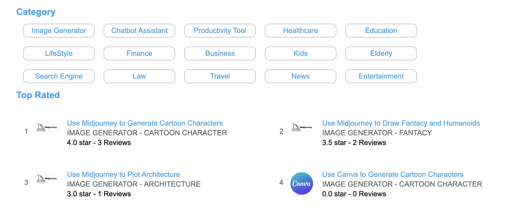
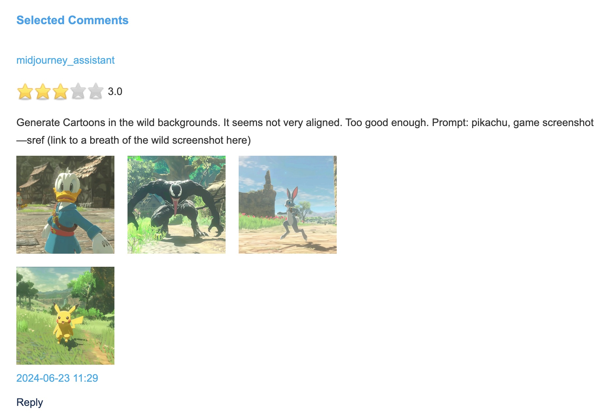
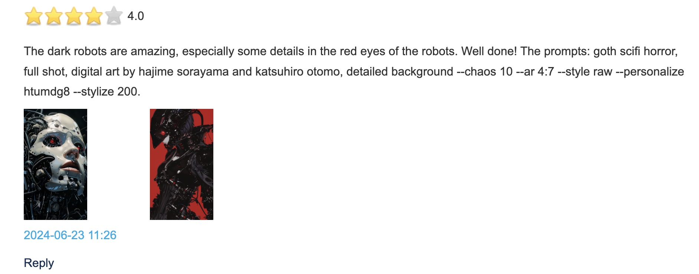

## AI Store of Image Generator: User Ratings, Reviews and Showcase

Website: [AI Image Generator User Rating and Reviews](http://www.deepnlp.org/store/image-generator)  

DeepNLP AI store is a platform and community for user to write genuine user reviews and ratings of AI apps and services. User can upload pictures as showcase of AI Image Generator,
such as Midjourney, Canva, Stable Diffusion, etc. People can write reviews about some common user prompts (questions or intents), such as "Generate Cartoon Characters", "Draw Fantacy and Humanoids", "Plot Architecture" and more.

#### List of Image Generator Use Case and ShowCase
##### Example

##### ShowCase
[Use Midjourney to Generate Cartoon Characters](http://www.deepnlp.org/store/image-generator/cartoon-character/pub-midjourney/use-midjourney-to-generate-cartoon-characters)  

[Use Midjourney to Draw Fantacy and Humanoids](http://www.deepnlp.org/store/image-generator/fantacy/pub-midjourney/use-midjourney-to-draw-fantacy-and-humanoids)  

[Use Midjourney to Plot Architecture](http://www.deepnlp.org/store/image-generator/architecture/pub-midjourney/use-midjourney-to-plot-architecture)

[Use Stable Diffusion to Generate Cartoon Characters](http://www.deepnlp.org/store/image-generator/cartoon-character/pub-stable-diffusion/use-stable-diffusion-to-generate-cartoon-characters)

[Use Stable Diffusion to Generate Fantacy and Humanoids](http://www.deepnlp.org/store/image-generator/fantacy/pub-stable-diffusion/use-stable-diffusion-to-generate-fantacy-and-humanoids)

[Use Canva to Draw Fantacy and Humanoids](http://www.deepnlp.org/store/image-generator/fantacy/pub-canva/use-canva-to-draw-fantacy-and-humanoids)
