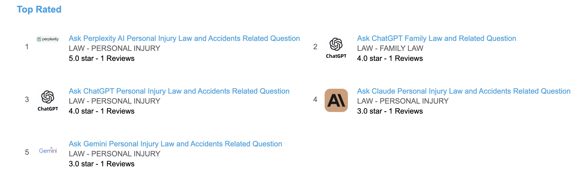

# AI Store for Law: User Ratings, Reviews and Showcase

[AI For Law and Legal User Rating and Reviews](http://www.deepnlp.org/store/law)  

#### List of AI for Law Use Cases

Prompts (Questions) exmaples include "How do I file divorce in California and I want my 3 years old son's custody" and 
"Do I need a personal injury lawyer to get compensation as victims of car or truck accident?", etc.

## ShowCases
### Personal Injury Law 
[Ask Perplexity AI Personal Injury Law and Accidents Related Question](http://www.deepnlp.org/store/law/personal-injury/pub-perplexity/ask-perplexity-ai-personal-injury-law-and-accidents-related-question)

[Ask ChatGPT Personal Injury Law and Accidents Related Question](http://www.deepnlp.org/store/law/personal-injury/pub-chatgpt-openai/ask-chatgpt-personal-injury-law-and-accidents-related-question)

[Ask Claude Personal Injury Law and Accidents Related Question](http://www.deepnlp.org/store/law/personal-injury/pub-claude-anthropic/ask-claude-personal-injury-law-and-accidents-related-question)

[Ask Gemini Personal Injury Law and Accidents Related Question](http://www.deepnlp.org/store/law/personal-injury/pub-gemini-google/ask-gemini-personal-injury-law-and-accidents-related-question)

### Family Law Divorce
[Ask ChatGPT Family Law and Related Question](http://www.deepnlp.org/store/law/family-law/pub-chatgpt-openai/ask-chatgpt-family-law-and-related-question)
