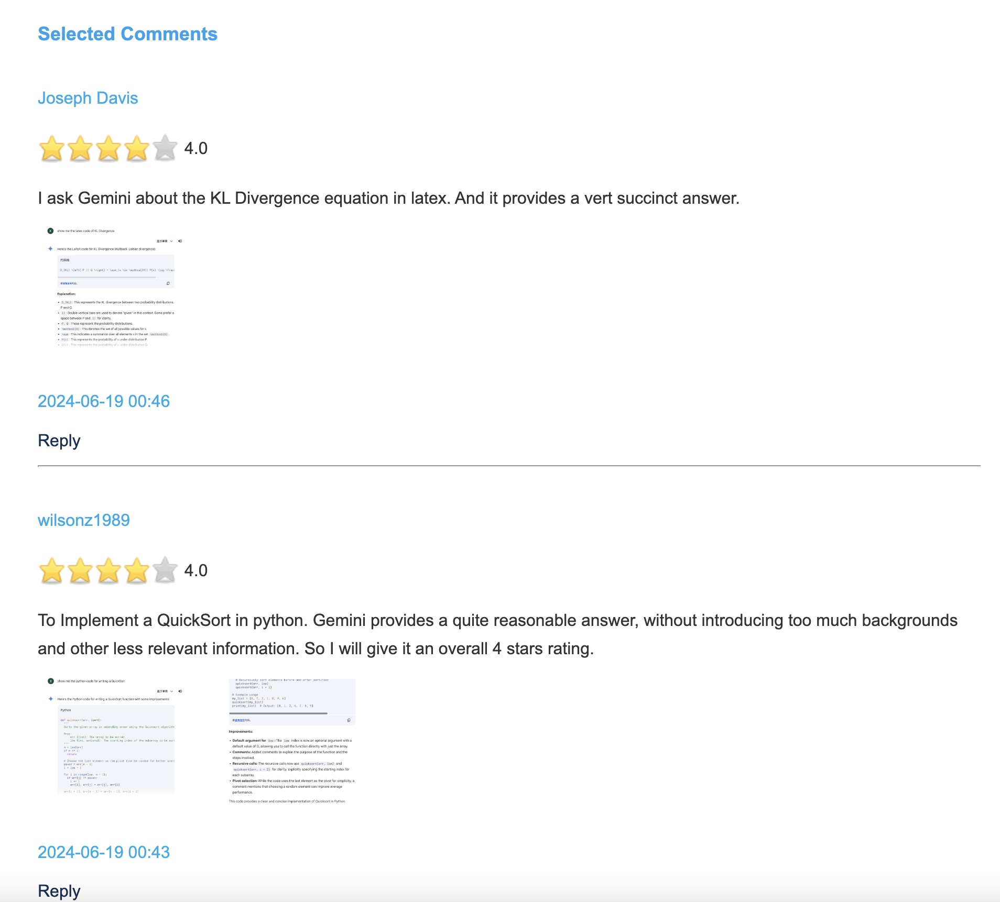

# AI Productivity Tool

Website: [AI Productivity Tool](http://www.deepnlp.org/store/productivity-tool)

### Writing Tool
[AI Productivity Tool-Writing Tool](http://www.deepnlp.org/store/productivity-tool/writing)

### Research Analysis

[AI Productivity Tool-Research & Analysis](http://www.deepnlp.org/store/productivity-tool/research-&-analysis)

###  Programming

[AI Productivity Tool-Programming](http://www.deepnlp.org/store/productivity-tool/programming)

### Prompts:
1. Show me the ${programming language} code of ${algorithm}, no explanation.
2. Write the ${programming language} to implement ${function}, no explanation.
3. Generate the ${programming language} code of a ${description} website, no explanation.
4. Find the ${statistic} from ${data_source} and display in ${format}.

e.g. 
1. Show me the latex code of KL Divergence
2. Write the python code for QuickSort Implementation
3. Generate the html code of a login page of a community website, no explanation.
4. Find the 2023 divorce rate of all states in US and display in the table and line chart.

#### ShowCase

##### Programming
[Gemini for Programming](http://www.deepnlp.org/store/productivity-tool/programming/pub-gemini-google/gemini-for-programming)

[ChatGPT for Programming](http://www.deepnlp.org/store/productivity-tool/programming/pub-chatgpt-openai/chatgpt-for-programming)

##### Plot Chat
[Use ChatGPT to Draw Plot of Math Function](http://www.deepnlp.org/store/productivity-tool/research-&-analysis/pub-chatgpt-openai/use-chatgpt-to-draw-plot-of-math-function)

##### Data Analysis
[Use Gemini to Conduct Data Analysis](http://www.deepnlp.org/store/productivity-tool/research-&-analysis/pub-gemini-google/use-gemini-to-conduct-data-analysis)

